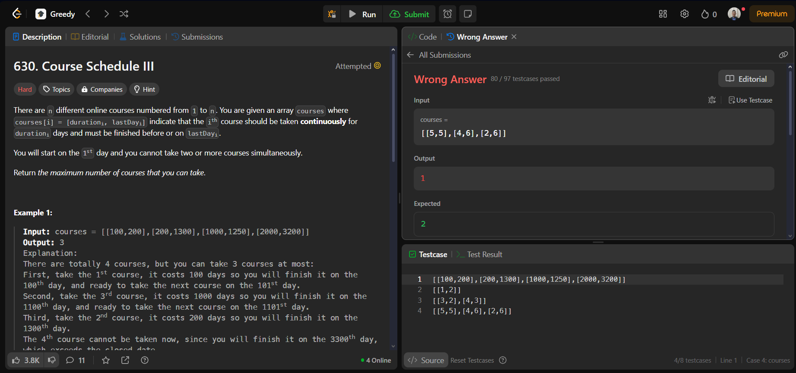
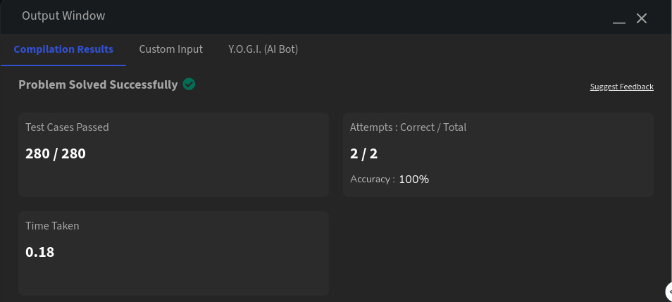
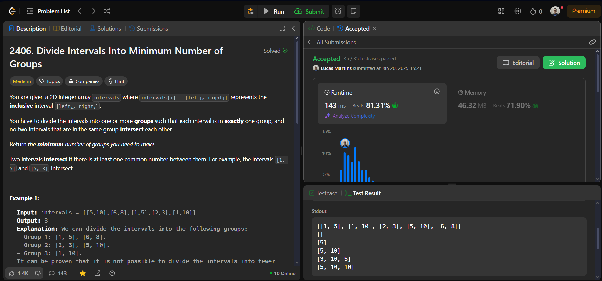

# Greed Questions

**Número da Lista**: 19 
**Conteúdo da Disciplina**: Greed 

## Alunos

| Matrícula | Aluno                 |
| --------- | --------------------- |
| 211061805 | Guilherme Westphall   |
| 221022088 | Lucas Martins Gabriel |

## Sobre 
O projeto consiste em resolver questões de programação utilizando a técnica de Greed de plataformas como o LeetCode e o GeekForGeeks. O objetivo é praticar os conceitos aprendidos durante o módulo de Greed.

# Questões

| Questão          | Título                                                                                                                                               | Dificuldade |
| ---------------- | ---------------------------------------------------------------------------------------------------------------------------------------------------- | ----------- |
| 630              | [Course Schedule III](https://leetcode.com/problems/course-schedule-iii/)                                                                            | Hard        |
|                  | [Huffman Decoding](https://www.geeksforgeeks.org/problems/huffman-decoding/1)                                                                        | Hard        |
| 2406             | [Divide Intervals Into Minimum Number of Groups](https://leetcode.com/problems/divide-intervals-into-minimum-number-of-groups/)                      | Medium      |

## Screenshots

### Course Schedule III

### Huffman Decoding

### Divide Intervals Into Minimum Number of Groups

## Instalação 
**Linguagem**: Python e C++ 

## Uso 
Para testar as soluções basta submeter o código nas respectivas plataformas de exercícios.

## Vídeo
[Vídeo YT](https://www.youtube.com/watch?v=-YYEjm7vo1Y)

