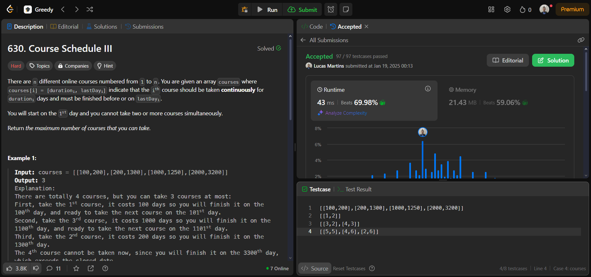

# Greed Questions

**Número da Lista**: 19 
**Conteúdo da Disciplina**: Greed 

## Alunos

| Matrícula | Aluno                 |
| --------- | --------------------- |
| 211061805 | Guilherme Westphall   |
| 221022088 | Lucas Martins Gabriel |

## Sobre 
O projeto consiste em resolver questões de programação utilizando a técnica de Greed de plataformas como o LeetCode e o GeekForGeeks. O objetivo é praticar os conceitos aprendidos durante o módulo de Greed.

# Questões

| Questão          | Título                                                                                                                                               | Dificuldade |
| ---------------- | ---------------------------------------------------------------------------------------------------------------------------------------------------- | ----------- |
| 630               | [Course Schedule III](https://leetcode.com/problems/course-schedule-iii/)                                                                          | Hard        |

## Screenshots
### Course Schedule III

## Instalação 
**Linguagem**: Python 

## Uso 
Para testar as soluções basta submeter o código nas respectivas plataformas de exercícios.

